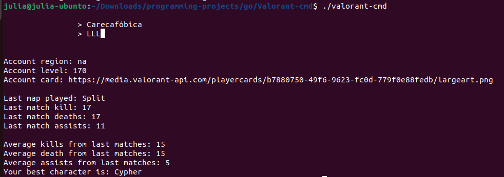

# BubbleTea-ValorantCMD: Terminal-Based Valorant Stats Tracker

## Description

BubbleTea-ValorantCMD is a robust terminal-based application that allows Valorant players to monitor their game statistics conveniently from their computer's terminal. This tool harnesses the power of the BubbleTea library for a smooth, user-friendly interface, and relies on the Unofficial Valorant API to obtain real-time game and player data.

## Features

- Check your Valorant performance metrics such as K/D ratio, win rate, and more.
- User-friendly command line interface powered by BubbleTea.
- Real-time data fetched via the Unofficial Valorant API.

## Installation & Setup

### Prerequisites

- Go Programming Language (Version 1.21.0 or higher)

### Build the Application

1. Clone the repository to your local machine:
    ```
    git clone https://github.com/Julia-Marcal/Valorant-cmd.git
    ```

2. Navigate to the project directory:
    ```
    cd BubbleTea-ValorantCMD
    ```

3. Build the Go application:
    ```
    go build
    ```

### Running the Application

1. After building, navigate to the location where the `valorant-cmd` executable is located.

2. Run the application with the following command:
    ```
    ./valorant-cmd
    ```

## Usage

1. When prompted, input your Valorant username and tag. Make sure to use the correct characters and capitalization to fetch accurate data.

2. Your Valorant stats will be displayed within the terminal window.

## Troubleshooting

- Ensure that you are using the correct username and tag, paying attention to case sensitivity.
- Make sure you have an active internet connection as this tool requires API access.

## Contribution

Feel free to open issues or submit pull requests to contribute to this project.

("Screenshot of a example")
